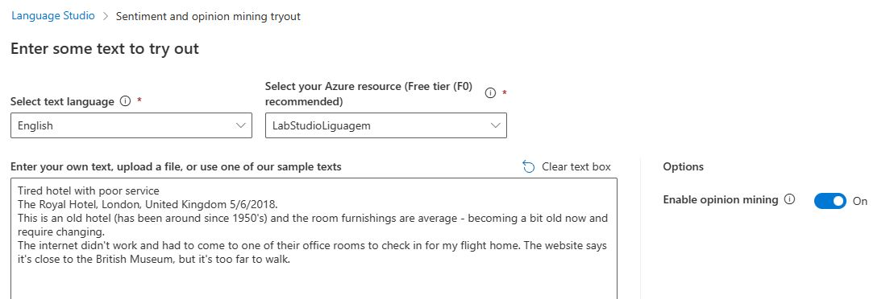
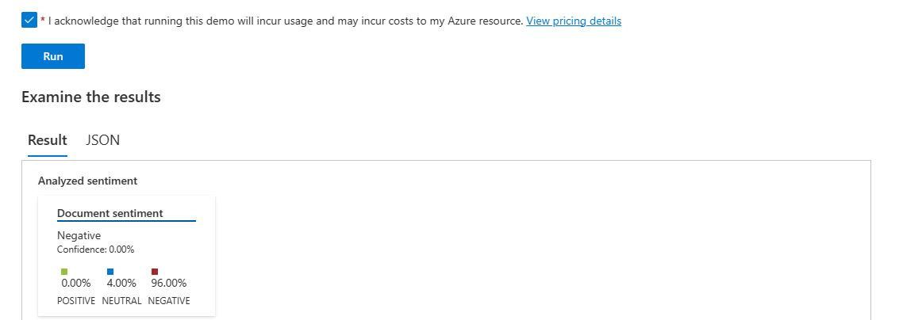
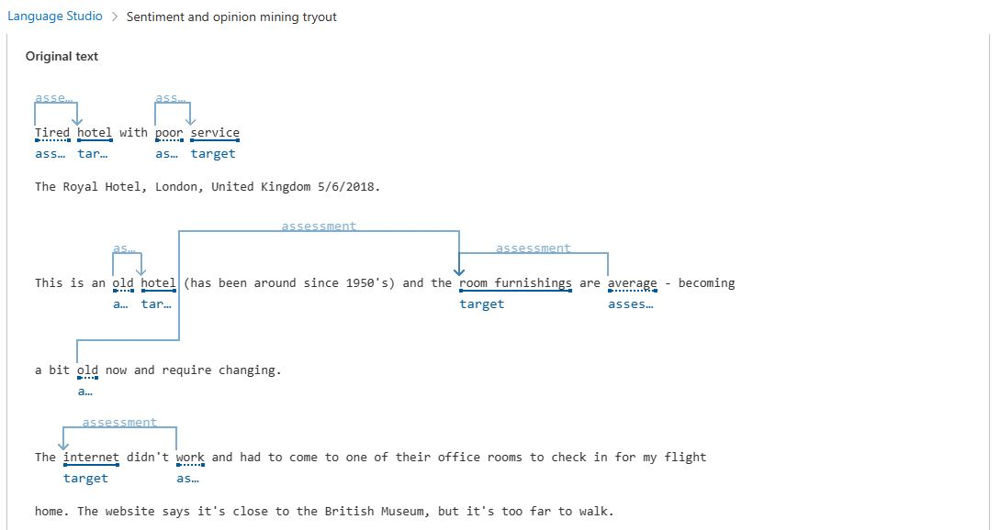
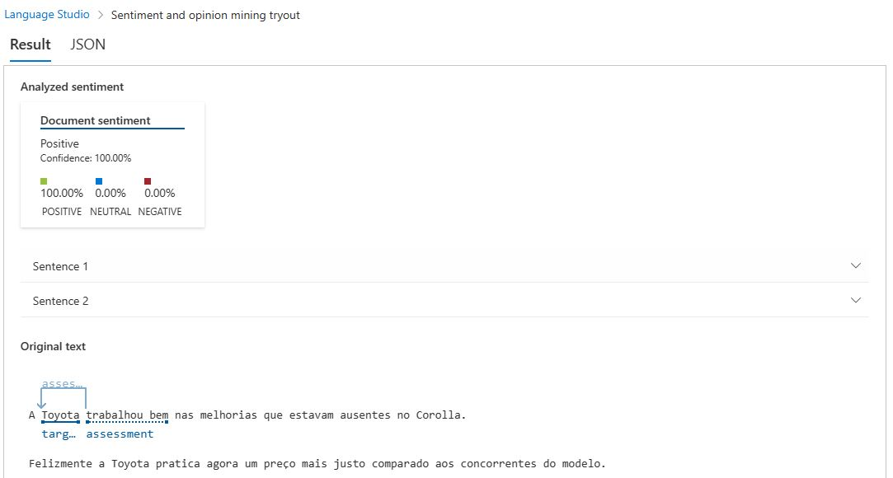

# Teste-Analise-Sentimento-Azure

Neste README explicarei um caso de uso da Ferramenta de Análise de Sentimentos dentro da Plataforma de __AI Services__ do __Microsoft Azure__.

## Criando um Recurso

Primeiramente foi criado um novo recurso dentro do Portal __Microsoft Azure__ para utilização da ferramenta __Language__ do __Microsoft Azure AI Services__.

## Abrindo Azure Language Studio

Após recurso criado, é necessário abrir o [Microsoft Azure Language Studio](https://language.cognitive.azure.com) e selecionar o recurso criado.

## Selecionando Ferramenta e Realizando Testes

### Fonte da Dados

"Tired hotel with poor service
The Royal Hotel, London, United Kingdom 5/6/2018.
This is an old hotel (has been around since 1950's) and the room furnishings are average - becoming a bit old now and require changing.
The internet didn't work and had to come to one of their office rooms to check in for my flight home. The website says it's close to the British Museum, but it's too far to walk."

"A Toyota trabalhou bem nas melhorias que estavam ausentes no Corolla.
Felizmente a Toyota pratica agora um preço mais justo comparado aos concorrentes do modelo."

### Ferramenta

Para o desafio de aprendizagem foi escolhida a ferramenta __Analyze sentiment and mine opinions__ para o análise de sentimentos dos textos escolhidos.

### Passos

Com a ferramenta escolhida é inserido o primeiro texto acima, conforme __Imagem 1__ abaixo.

Imagem 1

Após o texto inserido é só apertar o botão __"RUN"__ que a ferramenta fará a analise de sentimento do texto, conforme __Imagem 2__ e __Imagem 3__.

Imagem 2

Imagem 3

Conforme podemos ver através do resultado a ferramenta concluiu que a opinião emitida pelo cliente do Hotel foi negativa, ficando insatisfeita com a experiência de se hospedar no Hotel.

Também realizei outro teste com uma opinião positiva de um cliente a respeito da compra de um automóvel novo, conforme __Imagem 4__ abaixo.

Imagem 4

## Insights

Este serviço de AI do __Microsoft Azure__ para análise e identificação de sentimentos pode ser muito útil para empresas identificarem __feedbacks__ de seus clientes, algo que pode ser muito difícil de ser realizado por um ser humano quando a empresa recebe dezenas, centenas ou até milhares de opniões de seus clientes em pouco tempo.

Com os __feedbacks__ analisados, os dados podem ser utilizados para tomadas de decisões como melhorias nos produtos ou serviços e mudanças em campanhas de Marketing.

## Conclusão

Ferramenta de AI para análise de sentimentos é fácil de usar e os resultados foram precisos nos textos analizados. Devido aos ojetivo de aprendizagem não explorei a fundo esta ferramenta, mas creio que há um potencial muito grande para uso corporativo e governamental.

## Referências

- [Microsoft Azure](https://azure.microsoft.com)

- [AI Services-Language](https://azure.microsoft.com/pt-br/products/ai-services/ai-language/)

- [Microsoft Azure Language Studio](https://language.cognitive.azure.com/)

## Documentação

- [ML Learn AI Fundamentals - Analyse Sentiment](https://microsoftlearning.github.io/mslearn-ai-fundamentals/Instructions/Labs/06-text-analysis.html)

## Ferramentas e Serviços

- 

- 

- 